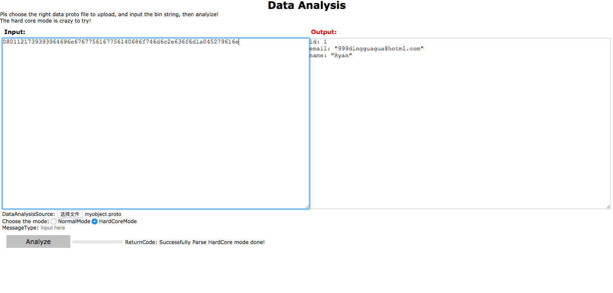

# postDataWebGo

- A google protobuf decoder by posting data on web page based on Golang.

## Quick start:
The google protobuf is not a self-describing format, so with a binary stream, pls prepare its 
proto type file, which needs to be uploaded when using this tool.
Normally, there're several steps:
- Post data on the web page Input
- Choose the proto file in DataAnalysisSource
- Click on the mode, HardCore mode might be an easy way(just click the Analyze)
- If the Normal Mode, pls input the message type's name in MessageType
- click Analyze
- the result or error reason will show on the webpage

Currently only support the hex data, such as: 08011217393939646e
Or: 08 01 12 17 39 39 64 69 6e.
Be careful with the data you input, such as wierd format, symbol or something.

## Two Modes:
- Normal Mode: parse the GPB binary string with the message type name and proto file
- HardCore Mode: you don't need to provide the message type name or with a header before
the GPB bin stream

## DataAnalysisWebFwk
file+data+shellcmd, this branch can be used for this mode.
Which you can use for other application, not just gpb decode.

## Install and Launch
### dependency
- Download a pre-built binary(protoc-$VERSION-$PLATFORM.zip) from the release page:
  [https://github.com/protocolbuffers/protobuf/releases](https://github.com/protocolbuffers/protobuf/releases)
- Install the binary
- cd postDataWebGo
- go run postDataWebGo.go
- launch a firefox or chrome with the address: <ServerIP>:8091

## Test Type
- proto2: verified pass
- proto3: on-going

## TODO
Describe in the code
